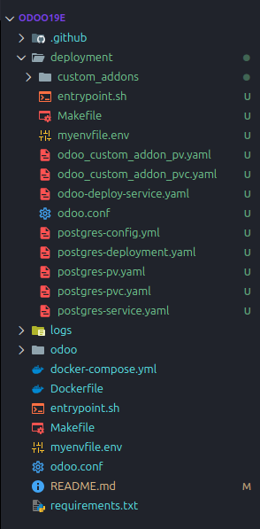

# Odoo 19 Dockerized Deployment

This project provides a simple Docker Compose setup for **Odoo 19** with **PostgreSQL** and **pgAdmin** for development or testing purposes.

---

## Project Structure

```
odoo19e/
├── custom_addons/          # Create manually for custom Odoo modules
├── Dockerfile              # Odoo image with dependencies
├── entrypoint.sh           # Startup script for Odoo
├── odoo.conf               # Odoo configuration file
├── docker-compose.yml      # Docker services definition
├── myenvfile.env           # Environment variables
├── VERSION.txt             # Image version tag
├── Makefile                # Build/push utilities
└── .github/                # GitHub Actions CI/CD workflow
```

---

## Quick Start

### 1. Clone the repo

```bash
git clone https://github.com/AungMoeWai1/odoo19e.git
cd odoo19e
```

### 2. Create custom addons folder

```bash
mkdir custom_addons
```

### 3. Configure environment variables

Create `myenvfile.env`:

```env
POSTGRES_DB=postgres
POSTGRES_USER=odoo
POSTGRES_PASSWORD=odoo

PGADMIN_DEFAULT_EMAIL=admin@example.com
PGADMIN_DEFAULT_PASSWORD=admin
```

### 4. Start services

```bash
docker-compose up -d
```

### 5. Check docker process

```bash
docker ps
```

### 5. Access

- **Odoo:** [http://localhost:8069](http://localhost:8069)  
- **pgAdmin:** [http://localhost:5050](http://localhost:5050) (login with `.env` credentials)

---

## Docker Hub CI/CD (Optional)

- Automatically builds and pushes the image when `Dockerfile` or `docker-compose.yml` changes.
- Requires GitHub Secrets:

  - `DOCKERHUB_USERNAME`
  - `DOCKERHUB_TOKEN` (Docker Hub Access Token)

---

## Manual Versioning

Update `VERSION.txt` with your desired version (e.g., `1.0.1`) and run:

```bash
make build   # Build Docker image
make push    # Push to Docker Hub
```

---

## Notes

- `custom_addons/` is mounted into the Odoo container. Changes in this folder reflect immediately.
- Use this setup for **development or testing**. For production, consider volumes, backups, and security configurations.

---

## Kubernetes Deployment

Below is a simple Kubernetes setup to run Odoo 19 + PostgreSQL using Deployments, Services, and Persistent Volumes.



## Quick Start

### 1. Clone the repo

```bash
git clone https://github.com/AungMoeWai1/odoo19e.git
cd odoo19e
```

### 2. Create custom addons folder

```bash
mkdir custom_addons
```

### 3. Create pv,pvc,configmap,deployment & service of postgres

```bash
kubectl apply -f postgres-pv.yaml
kubectl apply -f postgres-pvc.yaml
kubectl apply -f postgres-config.yaml
kubectl apply -f postgres-deployment.yaml
kubectl apply -f postgres-service.yaml
```

### 3. Create pv,pvc,configmap,deployment & service of odoo

```bash
kubectl apply -f odoo_custom_addon_pv.yaml
kubectl apply -f odoo_custom_addon_pvc.yaml
kubectl create configmap odoo-entrypoint --from-file=entrypoint.sh
kubectl create configmap odoo-config --from-file=odoo.conf
sudo ufw allow 37675/tcp
minikube mount ./custom_addons:/custom_addons --port=37675
kubectl apply -f odoo-deployment.yaml
kubectl apply -f odoo-service.yaml
```

### 4. check the created services:
```bash
kubectl get all
kubectl describe pod <podname> 
kubectl logs pod <podname>
kubectl get pv
kubectl get pvc
kubectl get configmap
```

### 5. Start run
```bash
minikube start
minikube service odoo-service
minikube ip
minikube dashboard
```


## License

My license

